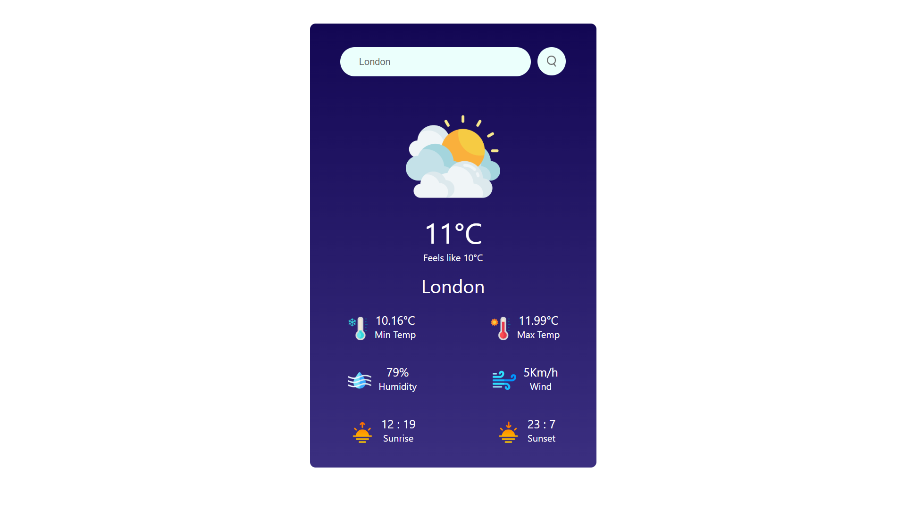

# 🌦️ Weather App

### This is a weather app built with React. It allows users to search for a location and get the current weather conditions.


## 🌐 Click on the Image 

<a href="https://omraj0.github.io/Weather-App/"></a>


## 🌟 Features 

🌦️ **Current Weather Display**:
   - Shows the current temperature in degrees Celsius. 🌡️
   - Displays the maximum and minimum temperatures for the day. 🔥❄️
   - Indicates the humidity percentage. 💧
   - Presents the wind speed in kilometers per hour (km/h). 💨

🌅 **Sunrise and Sunset Times**:
   - Fetches and displays the sunrise and sunset times for the user's location.
   - Formats the times in a user-friendly way.

☁️ **Weather Condition Icon**:
   - Uses weather icons (e.g., ☀️, ☁️, 🌧️) to visually represent the current weather condition.
   - Maps the weather condition (e.g., clear sky, rainy, cloudy) to the appropriate icon.

📱 **Responsive Design**:
   - Ensures the app looks good on various devices (desktop, tablet, mobile).
   - Uses responsive CSS to adapt to different screen sizes.


## 🚀 Quick Start

Getting started with the Random Meme Generator is a breeze:

1. Navigate to the directory where you want to store the project. You can use the `cd` command to change directories. For example, to navigate to your desktop, you can use:

   ```bash
   cd ~/Desktop
   ```

2. Clone the repository by running the following command. This will create a copy of the project on your computer:

   ```bash
   git clone https://github.com/omraj0/Weather-App.git
   ```

3. Once the repository is cloned, navigate to the project folder:

   ```bash
   cd Weather-App
   ```

4. **Install Dependencies:**

   ```bash
   npm install
   ```

5. **Start the App:**

   ```bash
   npm start
   ```

6. **Open Your Browser:**

   The app will be running at `http://localhost:3000`.

## 🌐 Live Demo

### Check out the live demo of the Weather App here: [Live Demo](https://omraj0.github.io/Weather-App/)

## 🌤️ Usage

To use the app, follow these steps:

- 🌍 Enter a city name in the search bar and click the search button.
- 🌡️ View the current weather conditions for the selected location.


## 🛠️ Technologies Used 

This app was built using the following technologies:

- ⚛️ React
- 🌐 OpenWeatherMap API

## 📞 Contact

If you have any questions or want to get in touch, feel free to reach out:

- Email: omraj010@gmail.com
- LinkedIn: [@Om Raj](https://www.linkedin.com/in/om-raj-915695228/)
  
## Happy weather tracking! ☔🌞
